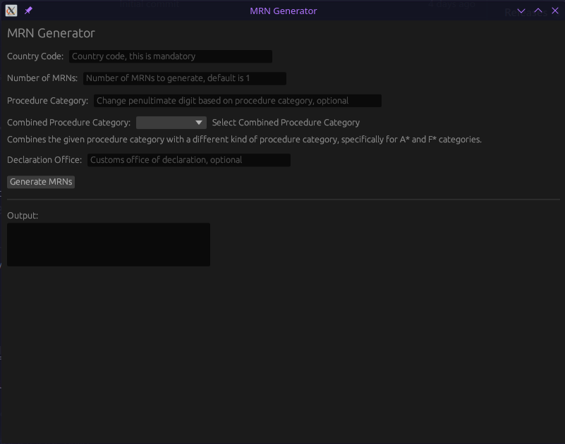
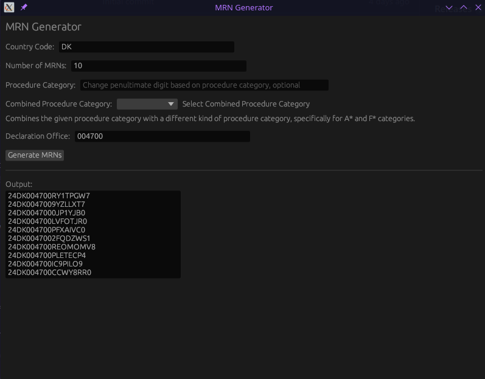
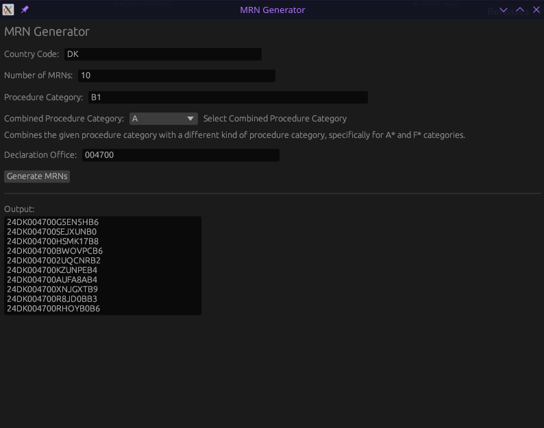

# MRN-Generator-UI

<!-- TABLE OF CONTENTS -->
<details>
  <summary>Table of Contents</summary>
  <ol>
    <li>
      <a href="#about-the-project">About The Project</a>
    </li>
    <li>
      <a href="#getting-started">Getting Started</a>
      <ul>
        <li><a href="#prerequisites">Prerequisites</a></li>
        <li><a href="#installation">Installation</a></li>
      </ul>
    </li>
    <li><a href="#screenshots">Screenshots</a></li>
    <li><a href="#license">License</a></li>
    <li><a href="#contact">Contact</a></li>
  </ol>
</details>

<!-- ABOUT THE PROJECT -->
## About The Project

This is a simple native GUI for [MRN Generator](https://github.com/iByteABit256/MRN-Generator)

<!-- GETTING STARTED -->
## Getting Started

### Prerequisites

To build the project locally you will need to [Install Rust](https://www.rust-lang.org/tools/install)

### Installation

```cargo build``` for a development build

```cargo build --release``` for a release build

<!-- SCREENSHOTS -->
### Screenshots






<!-- LICENSE -->
## License

Distributed under the MIT License. See `LICENSE.txt` for more information.

<!-- CONTACT -->
## Contact

Pavlos Smith - paulsmith4561+at+gmail.com

